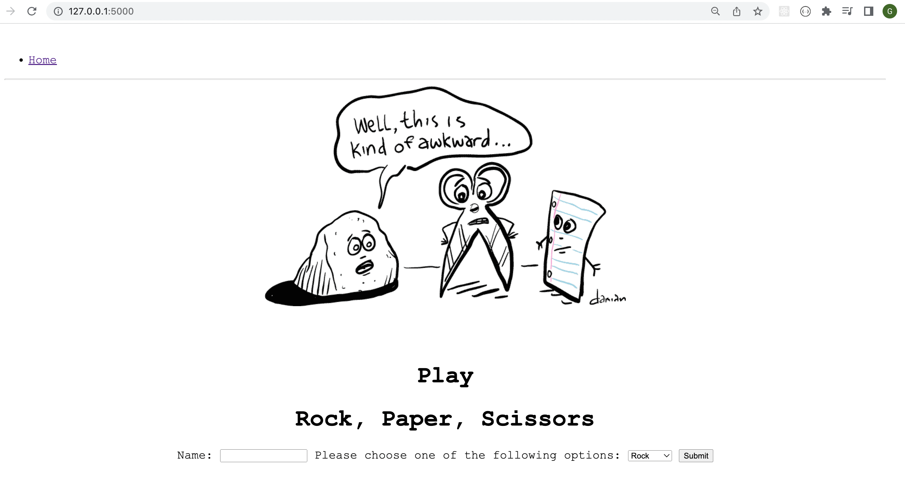

# Rock, Paper, Scissors Flask App

## Quick Start:

```
docker run -p 5000:5000 --name rps_app cleobrown/rps
```
---



## Project Brief: Build a Game <br>
Create a simple flask app to allow the user to play [rock, paper, scissors](https://en.wikipedia.org/wiki/Rock_paper_scissors
) in their browser. 


## Technologies:<br>

- HTML / CSS<br>
- Python<br>
- Flask<br>


## Manual steps to run
<br>Run:
```
flask run
```

App should be running on [localhost:3000](http://localhost:3000)


